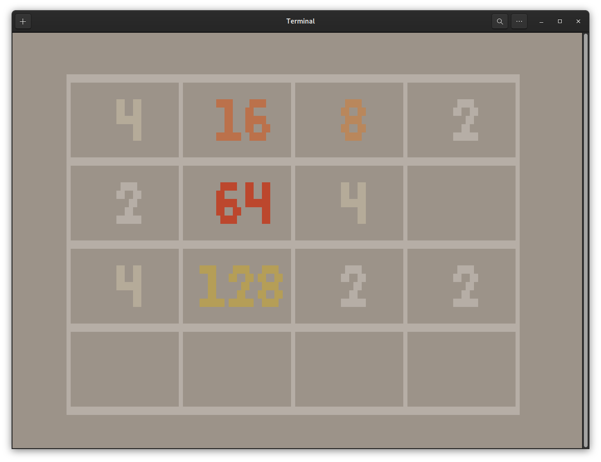

# 2048

A classic tile-matching puzzle game recreated for the terminal using ncurses, within 48 hours.


Table of Contents

- [Installation](#installation)
- [Usage](#usage)
- [Contributing](#contributing)
- [License](#license)
- [Authors](#authors)


## Installation

This project requires the ncurses library. You can install it using your system's package manager.

Linux/macOS:
<sub>Bash</sub>
```
sudo apt-get install libncurses5-dev  # Debian/Ubuntu
```
```
sudo yum install ncurses-devel       # RedHat/CentOS/Fedora
```
<sub>Use code with caution.</sub>

Once the dependency is installed, clone the repository and build the project:
<sub>Bash</sub>
```
git clone https://github.com/VulpesDev/2048 && cd 2048
make
```
<sub>Use code with caution.</sub>

This will create an executable named 2048 in the current directory.

## Usage

Run the game with the following command:
<sub>Bash</sub>
```
./2048
```

Controls:

    Arrow keys (↑ ↓ → ←) - Move tiles
    Escape (Esc) - Quit the game

Gameplay:

The objective of the game is to combine numbered tiles on a 4x4 grid to reach 2048. Use the arrow keys to move tiles in the chosen direction. When two tiles with the same number collide, they merge into a single tile with the sum of their values.

## Contributing

We welcome suggestions and contributions to improve this project. Feel free to fork the repository and submit a pull request with your changes.

## License

This project is licensed under the MIT License. See the LICENSE file for details.

## Authors

[dafneko](https://github.com/dafneko)

[VulpesDev](https://github.com/vulpesdev)

## Links

[Wikipedia - 2048 (video game)](https://en.wikipedia.org/wiki/2048_%28video_game%29)

[Wikipedia - Ncurses](https://en.wikipedia.org/wiki/Ncurses)
